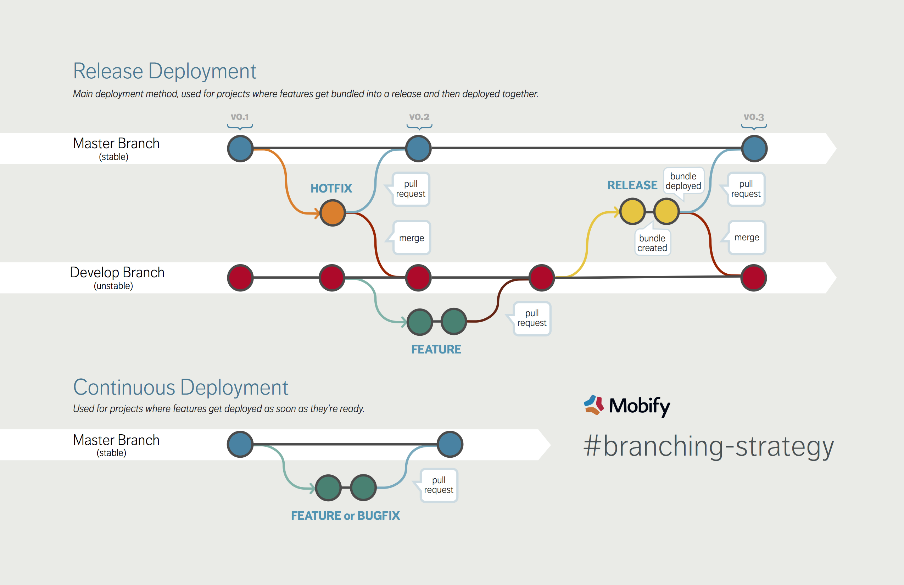

```
         `@@@:               `@@@:                                                        `@@@:   
        #@+:;@@             #@+:;@@                                                      #@+:;@@  
       #@:::::+@       @   #@:::::+@                                                    #@:::::+@
       @:::::::@;      @@  @:::::::@;                                                   @:::::::@;
      .@:::::::;@      @@@.@:::::::;@                                                  .@:::::::;@
      ;@::::::::@@@@@@@@@@@@::::::::@@@@@@@@@@@@@@@@@@@@@@@@@@@@@@@@@@@@@@@@@@@@@@@@@@@@@::::::::@
      `@:::::::+@      @@#`@:::::::+@                                                  `@:::::::+@
       @:::::::@`      @#  @:::::::@`                                                   @:::::::@`
       .@:::::@#       #   .@:::::@@:                                               @@@@@@:::::@#
        .@@@@@#       .     .@@@@@#.@#                                               @@@@.@@@@@#  
          `;.                 `;.    @@                                              '@@@  `;.    
                                      @@                                            @@`@@         
                                       @@`                                         @@  ;#         
                                        '@:    ;                                  @@    '         
                                         .@#  `+                                .@#               
                                           @@ @@                               '@;                
                                            @@@@                              @@`                 
                                            '@@@ #@@@@`               #@@@@` @@                   
                                           #@@@@@#,,,;@,        .    @#,,,;@@@                    
                                          ,    @+,,,,,,@        @.  @+,,,,,,@                     
                                               @,,,,,,,#+       @@. @,,,,,,,#+                    
                                              ,@,,,,,,,:@@@@@@@@@@@@@,,,,,,,:@                    
                                              ,@,,,,,,,:@@@@@@@@@@@@@,,,,,,,:@                    
                                               @,,,,,,,#+       @@. @,,,,,,,#+                    
                                               @+,,,,,,@        @.  @+,,,,,,@                     
                                                @#,,,;@,        .    @#,,,;@,                     
                                                 #@@@@`               #@@@@`                      
```

# Mobify Branching Strategy

This document represents Mobify's current branching and release strategy. It
provides a brief overview of the two release models that we use:
[release-based](release-deployment.md) and
[continuous delivery](continuous-deployment.md).



Each workflow tries to make things as simple as possible while still being
flexible enough to work for all teams at Mobify.

At the end of each document is a list of common scenarios you will encounter
and how Mobify's branching strategies apply.

## What is the purpose of this document?

As Mobify continues to grow and expand its operations globally, consistency
across all teams and partners is a key focus. The more aligned all Mobify
projects are, the more productive everyone will be.

This repository and its documentation outline:
* How we develop features
* When and how we create a release
* What to do when a hot fix is required
* Anything else related to our branching strategy

### This document is not...

**Written in stone.** Pull requests welcome! We will iterate on this document
based on feedback.

**The one true way to work on projects.** There are edgecases and this document
does not intent to answer them all.

**A guide on deployment or workflows.** Build deployment and workflow strategies
on top of these branching models in a way that best fits your team.

## Project Types

Depending on the type of project, one of two branching strategies is used:

### Continuous Deployment

Use this strategy for projects where features get deployed as soon as they're ready.

[Learn more](./continuous-deployment.md)

### Release Deployment

Use this strategy for projects where features get bundled into a release and then
deployed together.

[Learn more](./release-deployment.md)

## Branch Naming

Branch naming is left mostly up to the discretion of the person creating the branch
with a few exceptions. `master` and `develop` are always named exactly that. When a
feature/bugfix is related to a JIRA ticket we prefer that the branch name start with
the ticket number (eg. `hyb-545-add-headerbar`). Hotfix and release branches should
follow a pattern defined in the project type documents (ie. `release-vX.Y.Z` or
(eg. `hotfix-hyb-244-fix-db-connection-code`), but feature and bugfix branches
**don not** need a common prefix (ie. `feature-*`).

Branch names should use dashes to separate words of the name and should avoid any
uppercase letters.

Other than that, choose names that are descriptive and concise. You don't need a branch
name that is a novel because most branches should be relatively short-lived (hours to
days, not weeks).

## Git @ Mobify

Mobify uses git (specifically [Github](github.com)) for all source control. Git is
a very flexible tool and we have adopted some patterns when using git specifically
at Mobify. Think of it as the git equivalent of "Javascript - The Good Parts." :)

### Updating branches

** Important **

Git always works on a local copy of a repository. As a result, whenever you do any
operations that involve multiple branches (eg. merge) be sure to update both branches
before performing the operation.

### `git pull`

Git provides a single command to update your local branch with changes from a remote.
`git pull` is this command. Most of the time it does exactly what you want without
any problems, but you should know that `git pull` is really `git fetch` followed
by `git merge`. So when you pull from a remote, you're actually updating the remote
tracking branch (eg. `origin/mybranch`) and then merging that into your local
branch `mybranch`.

It's good to know that this happens under the hood. Some people prefer to do the
`git fetch` and `git merge` operations separately. Most of the time `git pull` will
do what you want and is an acceptable way to update your local branch with changes
from remote.

### Protected Branches

GitHub recently added [Protected branches](https://github.com/blog/2051-protected-branches-and-required-status-checks). Protected branches:
- Can't be force pushed
- Can't be deleted
- Can't have changes merged into them until required status checks pass

`master` and `develop` branches should always be protected. These protected branches
should never be directly committed to. They should only be updated through PR merges.

Projects that have continuous integration with a service such as CircleCI should
have their `master` and `develop` (if applicable) branches protected by a status
check requiring CircleCI builds to pass before changes can be merged.

## Anti-Patterns

After reading all of the above, none of the [Anti-Patterns](antipatterns.md) should
come as a surprise.
