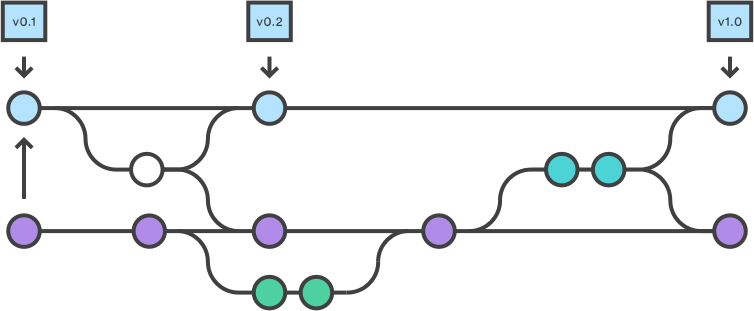
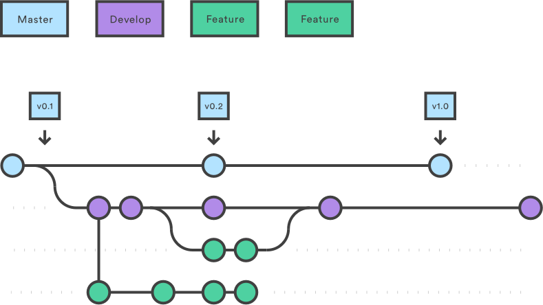

# Release Deployment

Use this strategy for projects where features get bundled into a release and then
deployed all at once.

We follow the [**Gitflow**](https://www.atlassian.com/git/tutorials/comparing-workflows/gitflow-workflow)
workflow as closely as possible. This page showcases common development scenarios
and how to deal with them from a branching point of view.

- [Branches Overview](#branches-overview)
- [Use Cases](#use-cases)
  - [Develop a new feature](#develop-a-new-feature)
  - [Develop multiple features in parallel](#develop-multiple-features-in-parallel)
  - [Create and deploy a release](#create-and-deploy-a-release)
  - [Change in plan, pull a feature from a release](#change-in-plan-pull-a-feature-from-a-release)
  - [Change request](#change-request)
  - [Production hot fix](#production-hot-fix)
- [Migrate a legacy project](#migrate-a-legacy-project)

## Branches Overview



| Branch        | Protected? | Base Branch | Description    |
| :-------------|:-----------|:------------|:---------------|
| `master`      | YES        | N/A         | What is live in production (**stable**).<br/>A pull request is required to merge code into `master`. |
| `develop`     | YES        | `master`    | The latest state of development (**unstable**). |
| feature       | NO         | `develop`   | Cutting-edge features (**unstable**). These branches are used for any maintenance features / active development. |
| `release-vX.Y.Z` | NO      | `master`    | A temporary release branch that follows the [semver](http://semver.org/) versioning. This is what is sent to UAT.<br/>A pull request is required to merge code into any `release-vX.Y.Z` branch. |
| bugfix        | NO         | `release-vX.Y.Z` | Any fixes against a release branch should be made in a bug-fix branch. The bug-fix branch should be merged into the release branch and also into develop. This is one area where we’re deviating from GitFlow. |
| `hotfix-*`    | NO         | `master`    | These are bug fixes against production.<br/>This is used because develop might have moved on from the last published state.<br/>Remember to merge this back into develop and any release branches. |

## Use Cases

### Develop a new feature



1. Make sure your `develop` branch is up-to-date

1. Create a feature branch based off of `develop`

   ```
   $ git checkout develop
   $ git checkout -b MYTEAM-123-new-documentation
   $ git push --set-upstream MYTEAM-123-new-documentation
   ```

1. Develop the code for the new feature and commit. Push your changes often. This
   allows others to see your changes and suggest improvements/changes as well as
   provides a safety net should your hard drive crash.

    ```
    $ ... make changes
    $ git add -A .
    $ git commit -m "Add new documentation files"
    $ ... make more changes
    $ git add -A .
    $ git commit -m "Fix some spelling errors"
    $ git push
    ```

1. Navigate to the project on [Github](www.github.com) and open a pull request with
   the following branch settings:
   * Base: `develop`
   * Compare: `MYTEAM-123-new-documentation`

1. When the pull request was reviewed, merge and close it and delete the
   `MYTEAM-123-new-documentation` branch.

### Develop multiple features in parallel

There's nothing special about that. Each developer follows the above [Develop a new feature](#develop-a-new-feature) process.

### Create and deploy a release


1. Merge `master` into `develop` to ensure the new release will contain the
   latest production code. This reduces the chance of a merge conflict during
   the release.

   ```
   $ git checkout develop
   $ git merge master
   ```

1. Create a new `release-vX.Y.Z` release branch off of `develop`.

   ```
   $ git checkout -b release-vX.Y.Z
   $ git push --set-upstream release-vX.Y.Z
   ```

1. Stabilize the release by using bugfix branches off of the `release-vX.Y.Z` branch
   (the same way you would do a feature branch off of `develop`).

   ```
   $ git checkout release-vX.Y.Z
   $ git checkout -b fix-label-alignment
   $ git push --set-upstream fix-label-alignment
   ... do work
   $ git commit -m "Adjust label to align with button"
   $ git push
   ```

1. When the code is ready to release, navigate to the project on
   [Github](www.github.com) and open a pull request with the following branch
   settings:
   * Base: `master`
   * Compare: `release-vX.Y.Z`
   Paste the Release Checklist into the PR body. Each project should define a release
   checklist. It will vary across projects, but you can refer to the Astro [Release](https://github.com/mobify/astro/blob/develop/RELEASE.md) document
   for an example.

1. At some point in the checklist you will merge the release branch into `master`.
   You can do this by using the "Merge pull request" button on the release PR.

1. Now you are ready to create the actual release. Navigate to the project page
   on Github and draft a new release with the following settings:
   * Tag version: `vX.Y.Z`
   * Target: `master`
   * Release title: `Release vX.Y.Z`
   * Description: Include a high-level list of things changed in this release.
   Click `Publish release`.

1. Merge the `release-vX.Y.Z` into `develop`.

    ```
    $ git checkout develop
    $ git merge release-vX.Y.Z
    $ git push
    ```

1. Finish off the tasks in the release checklist. Once everything is done, close
   the release PR.

**TBD: Discuss**
Mike N: Long-lived release branches, yes/no?

1. Create the release on Github from `master`.

### Change in plan, pull a feature from a release

**TBD: Discuss**
Mike N: That probably means recreating the release branch, unless we have short-lived release branches

### Change request

**TBD: Discuss**
Mike N: That probably means recreating the release branch, unless we have short-lived release branches

### Production hot fix

A production hotfix is very similar to a full-scale release except that you do
your work in a branch taken directly off of `master`. Hotfixes are useful in cases
where you want to patch a bug in a released version, but `develop` has unreleased
code in it already.

**TBD: Insert diagram**

1. Create a hot fix branch based off of `master`.

   ```
   $ git checkout master
   $ git checkout -b hotfix-documentation-broken-links
   $ git push --set-upstream hotfix-documentation-broken-links
   ```

1. Add a test case to validate the bug, fix the bug, and commit.

   ```
   ... add test, fix bug, verify
   $ git add -A .
   $ git commit -m "Fix broken links"
   $ git push
   ```

1. Navigate to the project on [Github](www.github.com) and open a pull request
   with the following branch settings:
   * Base: `master`
   * Compare: `hotfix-documentation-broken-links`
   Paste your release checklist into the PR and work through the PR to get the
   hotfix into production.

1. At some point in the checklist you will merge the hotfix branch into `master`.
  You can do this by using the "Merge pull request" button on the release PR.

1. Now that the hotfix code is in `master` you are ready to create the actual
   release. Navigate to the project page on Github and draft a new release with
   the following settings:
   * Tag version: `vX.Y.Z`
   * Target: `master`
   * Release title: `Release vX.Y.Z (hotfix)`
   * Description: Include a high-level list of things changed in this release.

  Click `Publish release`.

  *Note: Hotfix releases _are_ actual releases. You should bump at least the
  patch part of the version when releasing a hotfix and so even hotfixes go
  through the process of creating a release like this.*

1. Merge the `hotfix-documentation-broken-links` into `develop`.

   ```
   $ git checkout develop
   $ git merge hotfix-documentation-broken-links
   $ git push
   ```

1. Finish off the tasks in the release checklist. Once everything is done, close
   the hotfix PR.

## Migrate a legacy project

To migrate any git project to our branching strategy, please follow the instructions
in the [Migration](migration.md) document.

# Scenarios

This section outlines specific scenarios and the steps to take to ensure success.

## Deploying an Adaptive.js/Mobify.js Bundle to Production

The process for tagging and merging is a bit different when deploying a bundle, the steps to take are outlined here:


1. Ensure all features are merged into `release-v.X.Y.Z`

1. Create a bundle to be sent to the customer for verification and approval off of the `release-vX.Y.Z` branch.

	Ensure you have installed the automated bundle message script found [here] (https://	mobify.atlassian.net/wiki/questions/81789082/how-do-i-automate-a-bundle-message-using-bash). Follow these steps:

	```
	$ grunt push -m "$(message Mobile X.Y.Z)"
	```

1. When creating a pull request to merge the release branch into `master` ensure that the standard workflow for _creating a release_ is followed with these specific changes:
   * Name/Summary: `DEPLOYMENT MERGE: release-v.X.Y.Z, bundle <bundle number that was sent to customer>`
   * Description:

   ```
   Status: **Out to Customer**
   Owner: <Your Github username>
   Reviewers: Customer

   ## Bundle:
   - <bundle link sent to customer>

   ## Jira Tickets:
	- [x] <List of JIRA Tickets associated with release>

	## Todos:
	- [ ] Customer Approves Bundle <number>
	- [ ] Deploy Bundle <number>
	- [ ] Clean Up Repo
   ```

1. Once the customer has approved the bundle. The bundle is published to production and post launch tests occur. Once all tests have passed, the pull request is merged into `master`.

1. Finish the release workflow as described above and ensure that these specific changes are added:
   * Description: This should also include a link to a confluence JIRA report page that lists all issues in the release.
   Click `Publish release`.

   **NOTE: the release tag will be 1 commit ahead of the bundle commit**
